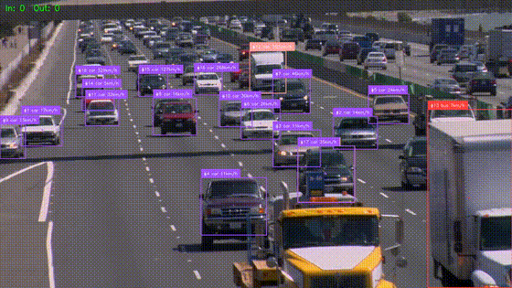

# Traffic Vehicle Detection, Tracking & Speed Analytics

An end-to-end computer vision pipeline that detects vehicles in traffic
footage, tracks each one with a persistent ID across frames, estimates
real-world speed via perspective transform, and counts vehicles crossing
a virtual line — packaged as a deployable API.



*Real output from the final model on real traffic footage — detection
boxes, persistent tracker IDs with motion traces, line-crossing counts,
and speed estimates (calibrated using a measured lane width; see the
Calibration section for the honest caveats on speed accuracy).*

## Final model

**Chosen configuration: YOLO11s @ 960px, trained on oversampled + undersampled + rare-class-augmented data.**

Checkpoint from epoch 7 (best.pt):

| Precision | Recall | mAP50 | mAP50-95 |
|---|---|---|---|
| 0.843 | 0.800 | 0.844 | 0.656 |

This beat every other configuration tried (see "Fine-tune on UA-DETRAC"
below for the full comparison, including a `WeightedRandomSampler`
alternative to file-based oversampling that was explored but did not
outperform this result). Use `runs/train/*/weights/best.pt` from this
specific run for the pipeline/demo below, not `last.pt` — every balanced
run in this project peaked early then declined, so the best checkpoint
is not the final epoch.

## What it does

Given a traffic video, the pipeline:
1. **Detects** vehicles per frame (YOLO11, fine-tuned on UA-DETRAC)
2. **Tracks** each vehicle across frames with a stable ID (ByteTrack)
3. **Estimates speed** in km/h per vehicle, using a perspective transform
   that maps pixel coordinates to real-world ground-plane distance
4. **Counts** unique vehicles crossing a defined line, split by direction
5. **Serves** results via a FastAPI endpoint, or renders an annotated
   output video with overlaid boxes, IDs, speeds, and running counts

## Why this project

Object detection alone is table stakes. This project's core signal is the
**full pipeline**: detection + multi-object tracking + downstream analytics
(speed, counting) + deployment — the same shape of system used in real
traffic-monitoring and smart-city deployments.

## Architecture

```
video frame
    │
    ▼
VehicleDetector (YOLO11)  ──► raw detections (boxes, class, confidence)
    │
    ▼
VehicleTracker (ByteTrack) ──► detections + persistent tracker_id
    │
    ├──► SpeedEstimator (perspective transform + position history) ──► km/h per track
    │
    └──► LineCounter (zone crossing) ──► cumulative in/out counts
    │
    ▼
Annotated frame / JSON summary
```

## Project structure

```
├── src/
│   ├── detector.py      # YOLO wrapper, vehicle-class filtering
│   ├── tracker.py        # ByteTrack wrapper
│   ├── perspective.py    # pixel -> real-world coordinate transform
│   ├── analytics.py      # speed estimation + line-crossing counter
│   └── pipeline.py       # ties it together, processes a video file
├── train/
│   ├── convert_detrac_xml_to_yolo.py  # converts raw UA-DETRAC XML -> YOLO format (4-class)
│   ├── oversample_rare_classes.py     # duplicates rare-class train images (bus/van/others)
│   ├── undersample_car.py             # removes car-only train images (reversible, never touches rare classes)
│   ├── add_test_split_rare_data.py    # merges real (non-duplicate) rare-class images from the test split
│   ├── weighted_sampler_trainer.py    # WeightedRandomSampler alternative to file-based oversampling
│   └── train_yolo.py     # fine-tuning script for UA-DETRAC (supports --augment-preset, --resume, --sampler)
├── tools/
│   └── calibrate.py      # interactive tool: click 4 points -> reusable calibration.json
├── api/
│   └── main.py           # FastAPI service (/analyze, /health)
├── tests/
│   └── test_pipeline.py  # unit tests for each component
├── data/
│   └── README.md         # UA-DETRAC download instructions
├── requirements.txt
└── Dockerfile
```

## Setup

```bash
pip install -r requirements.txt
```

## Usage

### Run the pipeline on a video file

```bash
python -m src.pipeline --source path/to/video.mp4 --output outputs/annotated.mp4
```

By default this uses stock COCO `yolo11n.pt` weights filtered to vehicle
classes — a working baseline with zero setup (Ultralytics' current
recommended default over the older YOLOv8). Swap in a UA-DETRAC
fine-tuned checkpoint via `--weights runs/train/ua_detrac_yolo11/weights/best.pt`
once trained.

### Fine-tune on UA-DETRAC

See `data/README.md` for downloading the dataset. Two paths:

- **4-class (recommended):** original Kaggle XML release, converted via
  `train/convert_detrac_xml_to_yolo.py` — preserves car/bus/van/others
  breakdown. Validated: 71,825 train / 10,260 val frames from a 51/9
  sequence split, with confirmed class distribution (car 83.7%, van 9.3%,
  bus 6.4%, others 0.7% — expect `others` to underperform given its rarity).
- **Single-class (faster):** pre-converted Roboflow mirror, collapses all
  vehicle types into one `vehicle` class — simpler but loses per-class
  evaluation.

Run the converter to produce the 4-class dataset:

```bash
python train/convert_detrac_xml_to_yolo.py \
  --xml-dir path/to/DETRAC-Train-Annotations-XML \
  --img-dir path/to/DETRAC-Images \
  --output-dir data/ua_detrac_yolo \
  --val-split 0.15
```

Then, optionally, address the class imbalance directly before training —
both scripts only touch the train split, val is never modified:

```bash
python train/oversample_rare_classes.py \
  --yolo-dir data/ua_detrac_yolo \
  --multipliers bus=3,van=2,others=8

python train/undersample_car.py \
  --yolo-dir data/ua_detrac_yolo \
  --remove-fraction 0.5 \
  --seed 42
```

Oversampling duplicates train images containing rare classes (moderate
3-8x multipliers, not full equalization — fully balancing against
`others` at 0.7% would mean duplicating a handful of images 100+ times
each and overfitting on them specifically). Undersampling then removes
half of the remaining car-**only** images (never touching images that
also contain a rare class, so no rare-class example is ever lost) —
moves the balance further than oversampling alone, since ~84% of images
contain a car incidentally even after oversampling. Confirmed real
result from this project: car 83.7% → 79.7% (oversample only) → 78.7%
(oversample + undersample).

Optionally, also merge in real (non-duplicate) rare-class images from
UA-DETRAC's official **test** split, which your own val split never
touches:

```bash
python train/add_test_split_rare_data.py \
  --xml-dir /kaggle/input/datasets/bratjay/ua-detrac-orig/DETRAC-Test-Annotations-XML/DETRAC-Test-Annotations-XML \
  --img-dir /kaggle/input/datasets/bratjay/ua-detrac-orig/DETRAC-Images/DETRAC-Images \
  --train-dir /kaggle/working/ua_detrac_yolo/train
```

Note `--img-dir` is the same `DETRAC-Images` folder used for training —
this dataset mirror stores train and test sequence images together in
one shared pool, distinguished only by which XML annotation folder you
point at.

Only images containing a rare class are added (car-only test images are
skipped). **Honest caveat:** this uses UA-DETRAC's official test split
for training, so results are no longer directly comparable to the
standard benchmark protocol — disclose this as a custom split in any
writeup, not an official benchmark number.

Then train:

```bash
python train/train_yolo.py --data data/ua_detrac_yolo/data.yaml --epochs 25 --device 0 --augment-preset rare-class
```

**Alternative to file-based oversampling:** `--sampler weighted` uses
PyTorch's `WeightedRandomSampler` to sample rare-class images more often
on-the-fly from the *original, unmodified* image folder — no file
duplication, no doubled dataset size, no extra disk usage or epoch-time
cost (oversampling alone roughly doubled this project's dataset size).
Per-image weight is computed automatically from each class's inverse
frequency (the rarest class present in an image sets that image's
weight — max, not sum, so an image with multiple rare classes doesn't
get an extreme runaway weight). No manual multipliers to tune. Fresh
runs only (not compatible with `--resume`). Works correctly for both
single-GPU and multi-GPU (`--device 0,1`) training — multi-GPU needed a
genuinely different, custom-partitioned sampler, not just a plain
`WeightedRandomSampler`, since without partitioning every GPU would
otherwise redundantly draw from the entire dataset independently.
Verified end-to-end: confirmed `model.train(trainer=...)` is an
officially supported Ultralytics hook (by reading its source, not
assumed), a real training run completes successfully through the actual
CLI (not just the trainer module in isolation), a 10,000-draw
distribution test confirming a weight-5 image is genuinely sampled ~5x
as often as a weight-1 image, and a dedicated test confirming the
multi-GPU sampler partitions deterministically with no full overlap
between ranks and correctly reshuffles each epoch.

Pass `--device 0,1` if training on multiple GPUs (e.g. Kaggle's free T4 x2).
`--batch -1` enables autobatch (single-GPU only — Ultralytics requires an
explicit multiple-of-GPU-count batch size for multi-GPU training).

`--augment-preset rare-class` tunes Ultralytics' built-in augmentation
(mixup, copy_paste, viewpoint/color jitter) more aggressively toward
helping small/rare objects specifically. Note: Ultralytics applies *some*
augmentation automatically even with `--augment-preset default` (its own
baked-in defaults); this preset just tunes it further, it isn't turning
augmentation on from nothing.

**Resuming an interrupted run:** pass `--resume path/to/last.pt` to
restore the exact optimizer state and learning-rate schedule position
(not just reloading weights into a fresh run, which restarts the LR
curve). If the checkpoint's originally-saved data path no longer exists
in a new session, pass `--data` too — the script fails loudly if you
don't, rather than let Ultralytics silently substitute its own bundled
sample dataset (a real, verified failure mode, not a hypothetical one).
Use `--resume-save-dir` if the checkpoint lives on a read-only path (e.g.
a Kaggle Model/Dataset input) to redirect output somewhere writable.

**Confirmed empirical results from this project** (all figures from
verified checkpoint files or tracked validation runs, not estimates):

| Config | Resolution | Precision | Recall | mAP50 | mAP50-95 |
|---|---|---|---|---|---|
| YOLO11n, no balancing | 640px | 0.816 | 0.641 | 0.721 | 0.560 |
| YOLO11s, no balancing | 960px | 0.812 | 0.737 | 0.772 | 0.610 |
| YOLO11s, oversampled + augmented | 960px | 0.835 | 0.788 | 0.837 | 0.646 |
| YOLO11s, oversampled + undersampled + augmented | 960px | **0.843** | **0.800** | **0.844** | **0.656 🏆** |

🏆 = **final chosen model** (see "Final model" callout at the top of
this README). Two real, separate levers contributed to this result:
model/resolution (YOLO11n@640 → YOLO11s@960, a real but modest gain) and
data balancing + augmentation (the larger remaining gain, on top of
that). Every metric — including precision — improved together;
balancing did not trade precision away for recall, which is a common
failure mode of naive imbalance fixes.

**`WeightedRandomSampler` alternative — explored, not adopted:**
`train/weighted_sampler_trainer.py` (see below) was built and tested as a
file-duplication-free alternative to physical oversampling. Two weight
schemes were tried head-to-head against the winning file-based config:

| Sampler weights (car,bus,van,others) | Peak mAP50-95 | Peak epoch |
|---|---|---|
| 1, 3, 2, 8 (matching the file-based multipliers) | 0.644 | 17 |
| 1, 4, 4, 6 | 0.637 | 10 |

Both underperformed the file-based winner (0.656) even after combining
the sampler with undersampling and confirming identical augmentation
settings — ruling out the two most obvious confounds. The most likely
remaining explanation: `WeightedRandomSampler` alone doesn't replicate
oversampling's *inflated total dataset size* (2.24x in this project) —
at the same nominal epoch number, the file-based run had simply seen
more total images. `weighted_sampler_trainer.py` now supports an
`EPOCH_MULTIPLIER` setting to correct for this if you want to continue
this comparison further; it was implemented and unit-tested but not
re-run against the full dataset, since the file-based result was judged
strong enough to finalize on.

**Training dynamics, not just final numbers:** every balanced/augmented
run showed the same shape — a real climb, then a peak, then a gentle
decline. This is consistent with overfitting on duplicated/over-sampled
images, not a hard data ceiling — worth tracking per-epoch validation
metrics and keeping the best checkpoint (`best.pt`), not just the final
epoch's `last.pt`, since later epochs are not necessarily better.

### Run the API

```bash
uvicorn api.main:app --host 0.0.0.0 --port 8000
```

```bash
curl -X POST http://localhost:8000/analyze -F "video=@path/to/video.mp4"
```

Returns JSON with frame count, in/out vehicle counts, per-track max speed,
and detection class breakdown.

### Run with Docker

```bash
docker build -t traffic-analytics .
docker run -p 8000:8000 traffic-analytics
```

### Run tests

```bash
pytest tests/ -v
```

## Calibration — getting real speed numbers

Pixel movement between frames means nothing in km/h until the code knows
how many real-world meters one pixel represents in your specific
video/camera angle. There's no way to derive this automatically from
video alone (that's an open research problem, not a solved one) — so
calibration is a one-time, per-camera setup step:

```bash
python tools/calibrate.py --video your_video.mp4 --output calibration.json
```

This opens the video's first frame, lets you click 4 points forming a
rectangle on the road (e.g. lane edges over a measured stretch), and asks
for that rectangle's real-world width/length in meters. It saves a
reusable `calibration.json` — run this once per camera angle, not once
per video.

**Practical lesson from actually doing this on real traffic footage:**
getting one real distance (e.g. lane width, often ~3.5m and easy to look
up) is usually the easy part. Getting a **second** real distance — for
the rectangle's other dimension — is often the hard part, since it
requires either a visible, measurable reference in the specific footage
(e.g. a known gap between two lane-dash markings) or an estimate you're
willing to state as an assumption. Heavy traffic can also occlude lane
markings at exactly the rows you'd want to click. If you only have one
solid real measurement, it's fine to proceed with a clearly-labeled
*assumption* for the second — just disclose which parts of your
calibration are measured vs. assumed in any writeup, since the assumed
dimension is where speed accuracy is most likely to be off.

Then pass it to the pipeline or API:

```bash
python -m src.pipeline --source your_video.mp4 --calibration calibration.json
```

```bash
curl -X POST http://localhost:8000/analyze \
  -F "video=@your_video.mp4" \
  -F "calibration=@calibration.json"
```

**If you omit `--calibration`**, the pipeline falls back to a placeholder
calibration (`src/perspective.py`'s `example_calibration()`) and prints a
loud warning — those speed numbers are not real, only useful for testing
the pipeline mechanics. The API's `/analyze` response also includes a
`calibration_used` flag and `speed_warning` field so callers can't
mistake placeholder numbers for real ones. Document whichever you used
explicitly in any writeup — it's the honest caveat on the speed numbers.

**End-to-end validation:** the full pipeline (detection + tracking +
speed + counting) was run against the actual final checkpoint
(oversampled+undersampled+augmented, epoch 7) on real traffic footage —
confirmed working: correct 4-class detection, persistent tracker IDs
with motion traces, line-crossing counts, and calibrated speed values
using a real measured lane width plus a disclosed-assumption second
dimension (see the calibration section above for why that second
dimension is often the harder one to pin down).

## Evaluation

After fine-tuning, report:
- mAP@50, mAP@50-95 (overall and per-class, since UA-DETRAC's 4 classes
  are imbalanced — Car dominates, Bus/Van/Other are comparatively rare)
- Tracking ID-switch rate on a held-out clip (qualitative, since UA-DETRAC's
  ground truth is per-detection, not per-track-ID)
- Inference FPS on CPU vs GPU, since real-time throughput is the practical
  constraint for this use case

**Confirmed per-class result** (YOLO11s baseline, before balancing —
genuinely counterintuitive, worth reporting): rarity alone did not
predict per-class difficulty. `bus` (1,008 instances, second-rarest)
scored the *highest* mAP50-95 of any class (0.707) — higher than `car`
(74,294 instances, 0.615). Likely explanation: buses are large and
visually distinctive, easier to localize correctly once the model has
seen enough examples, while `van` and `others` are visually more varied
and ambiguous despite `van` having far more training instances. Don't
assume instance count alone determines which classes need attention —
check per-class metrics directly.

## License

This project's original code is licensed under the [MIT License](LICENSE).
UA-DETRAC is a public academic benchmark — see `data/README.md` for the
citation to include if referencing it in writeups. Ultralytics (YOLO11)
is licensed separately under AGPL-3.0 (or a commercial license) —
review [Ultralytics' licensing](https://www.ultralytics.com/license)
before any commercial use of a model trained with this repo.
